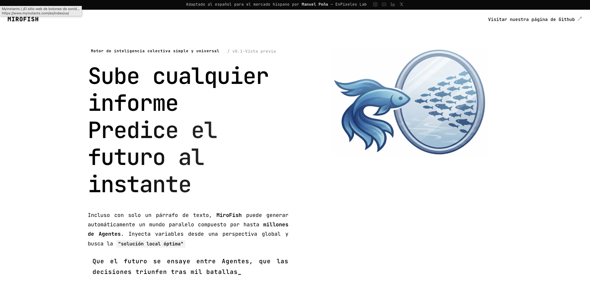
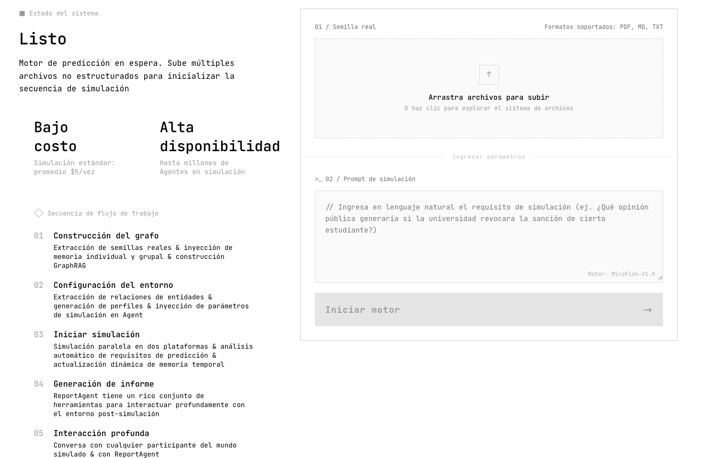
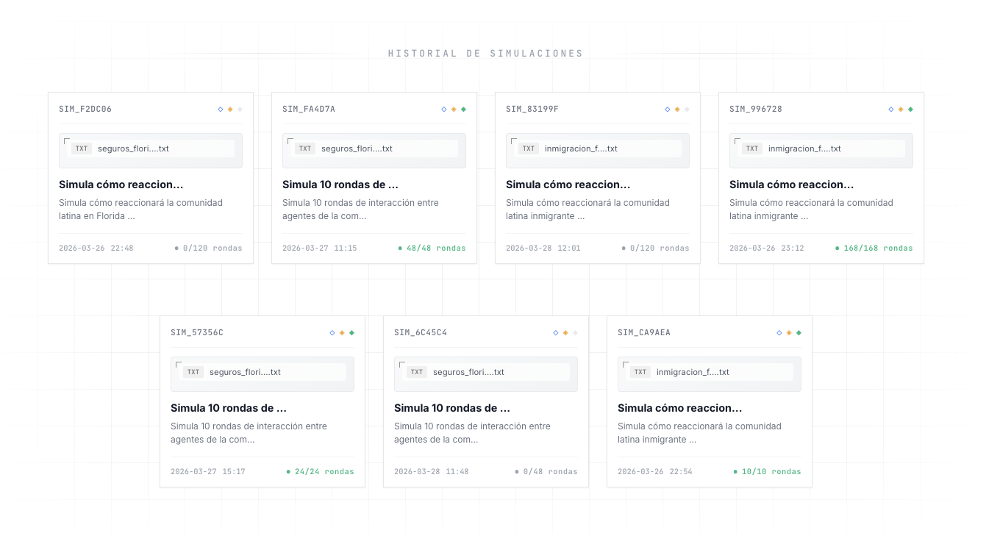
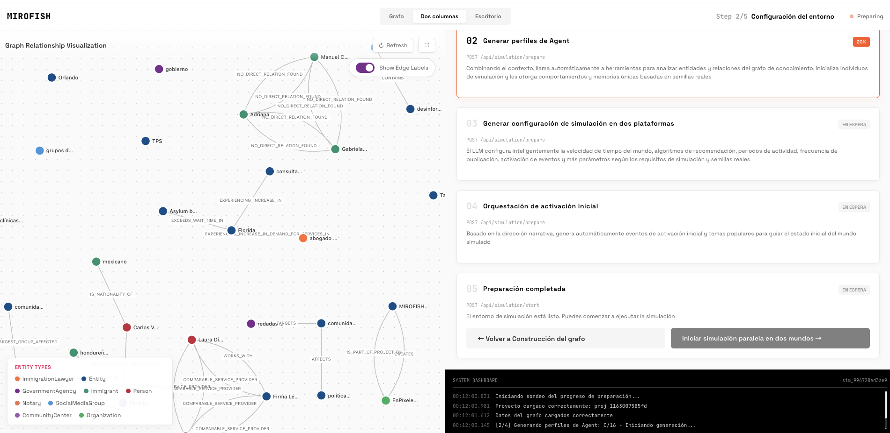
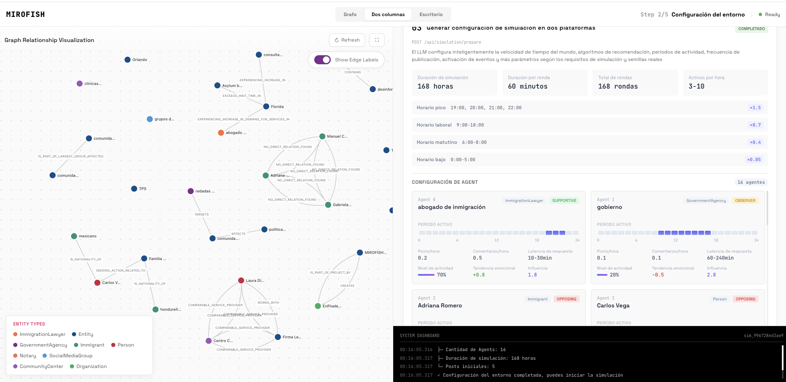
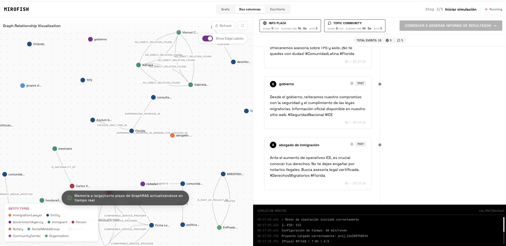
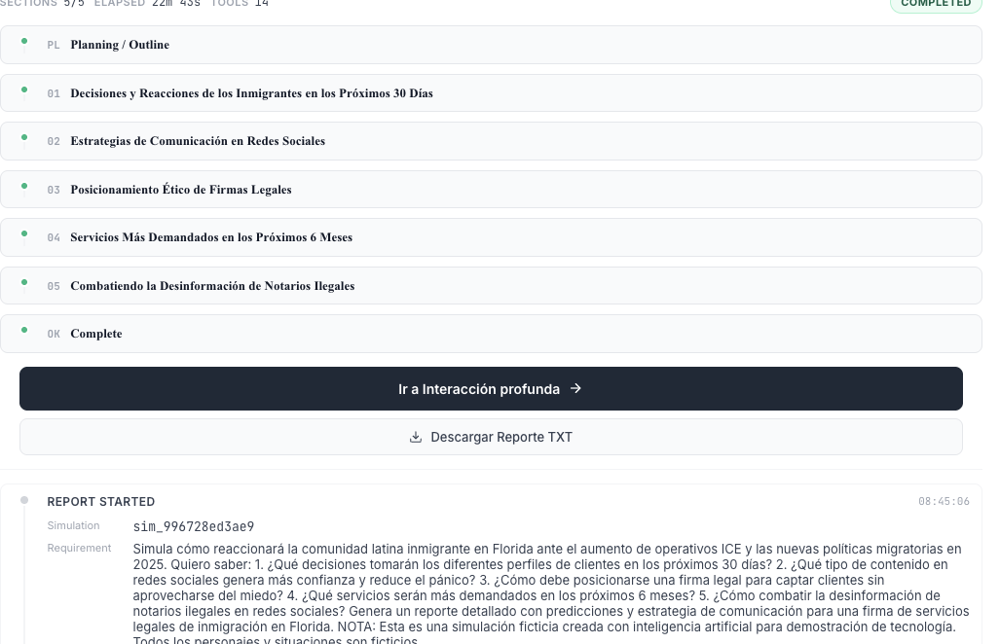
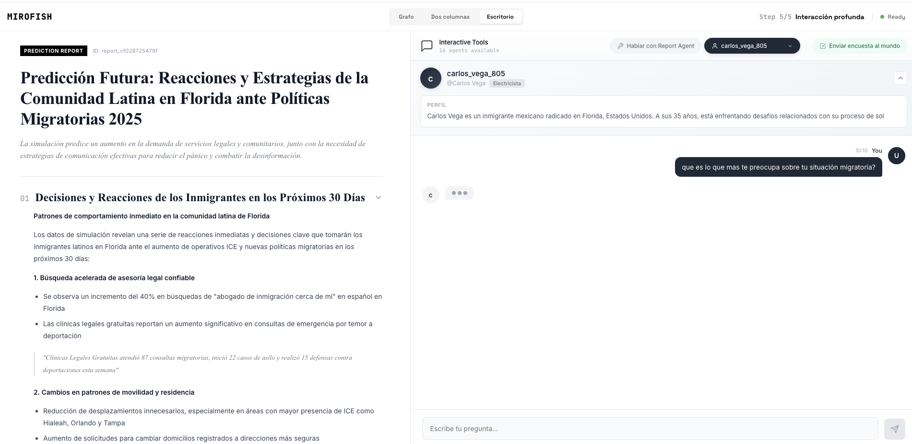
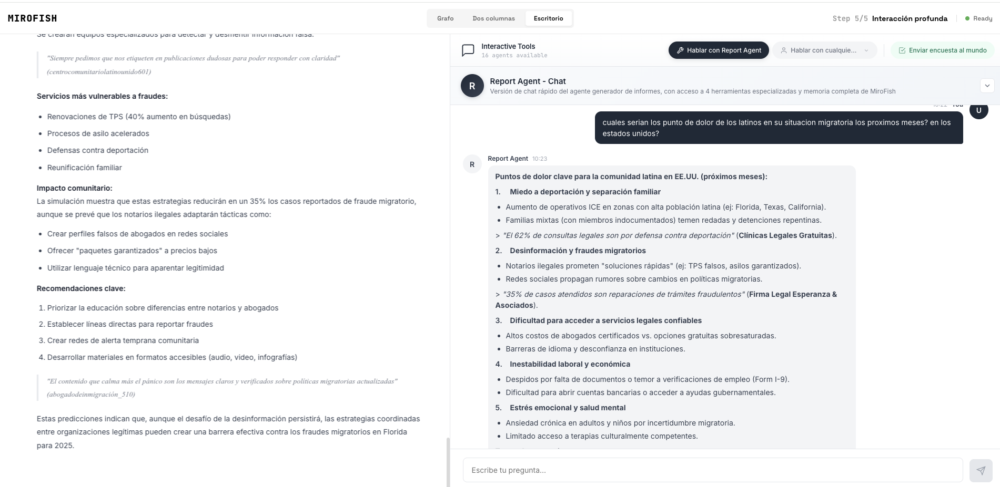
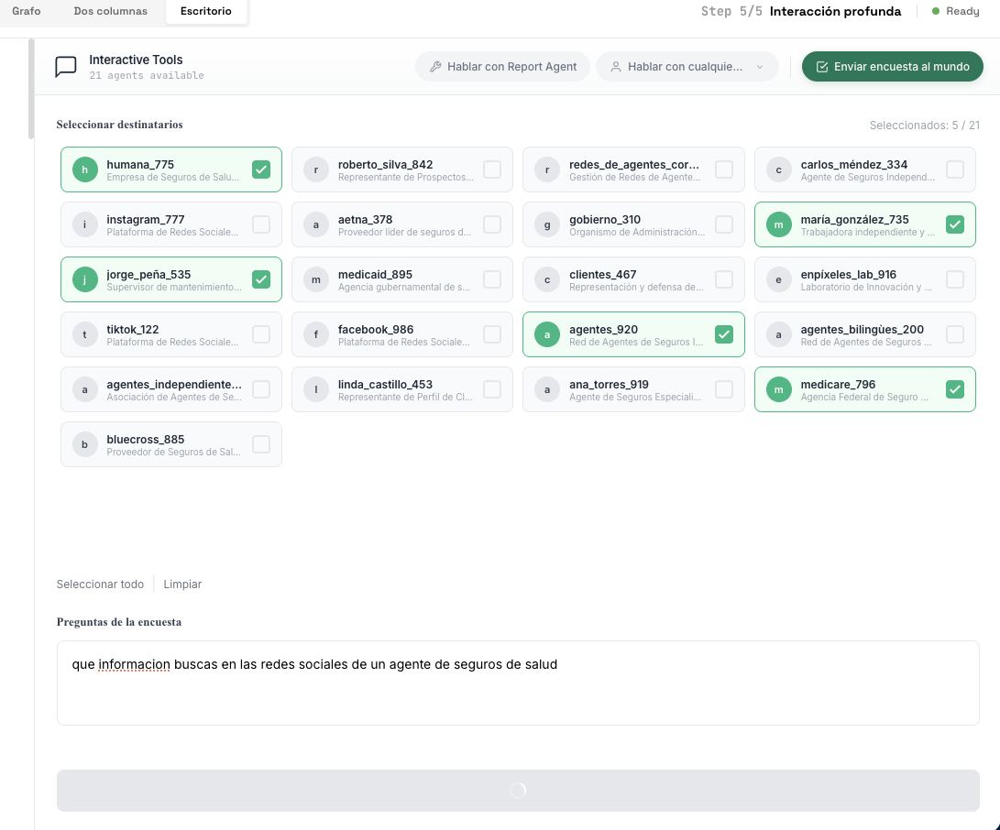

<div align="center">


<a href="https://github.com/666ghj/MiroFish" target="_blank"></a>

Motor de inteligencia colectiva simple y universal para el mercado hispano
</br>
<em>Sube cualquier informe · Predice el futuro al instante</em>

<a href="https://www.instagram.com/enpixelesmedia/" target="_blank"></a>

[](https://github.com/enpixeles-ai/MiroFish)
[](https://github.com/666ghj/MiroFish/stargazers)
[](https://github.com/666ghj/MiroFish/network)
[](https://hub.docker.com/)
[](LICENSE)

[](https://www.instagram.com/enpixelesmedia/)
[](https://www.youtube.com/@enpixelamedia)
[](https://www.linkedin.com/in/expixeles/)
[](https://x.com/Enpixelesmedia)

[🇪🇸 Español](./README.md) | [🇺🇸 English](./README-EN.md)

</div>

## ⚡ Visión General

**MiroFish** es un motor de predicción de nueva generación impulsado por tecnología multi-agente. Al extraer información semilla del mundo real (como noticias de última hora, borradores de políticas o señales financieras), construye automáticamente un mundo digital paralelo de alta fidelidad. En este espacio, miles de agentes inteligentes con personalidades independientes, memoria a largo plazo y lógica conductual interactúan libremente y experimentan evolución social. Puedes inyectar variables dinámicamente desde una "visión divina" para deducir con precisión las trayectorias futuras — **ensaya el futuro en un sandbox digital y gana decisiones después de innumerables simulaciones**.

> Solo necesitas: Subir materiales semilla (informes de análisis, noticias, datos de mercado) y describir tus requisitos de predicción en lenguaje natural
>
> MiroFish te devolverá: Un informe de predicción detallado y un mundo digital de alta fidelidad con el que podrás interactuar profundamente

### 🌎 Nuestra Visión para el Mercado Hispano

MiroFish en español está dedicado a crear un espejo de inteligencia colectiva que mapea la realidad del mercado hispano. Al capturar la emergencia colectiva desencadenada por interacciones individuales, rompemos las limitaciones de la predicción tradicional:

- **A nivel macro**: Somos el laboratorio de ensayo para agencias, empresas y profesionales del mercado hispano — permite probar estrategias de marketing, comunicación y ventas con riesgo cero
- **A nivel micro**: Somos el sandbox creativo para agentes de seguros, abogados de inmigración, agentes de real estate y emprendedores latinos — todo accesible, práctico y en tu idioma

Desde predicciones serias hasta simulaciones creativas, hacemos que cada "¿qué pasaría si...?" pueda verse antes de que ocurra.

---

## 🏆 ¿Por Qué Esta Versión en Español?

El proyecto original tiene **+45,000 estrellas en GitHub** — uno de los proyectos de IA más virales de 2025/2026. Sin embargo, **toda la documentación, interfaz y prompts estaban íntegramente en chino**, haciendo el sistema completamente inaccesible para los 500 millones de hispanohablantes del mundo.

Esta adaptación cambia eso:

| Característica | Original (chino) | Esta versión (español) |
|----------------|-----------------|----------------------|
| Interfaz de usuario | 中文 | Español Latino ✅ |
| Razonamiento de agentes | 中文 | Español Latino ✅ |
| Reportes generados | 中文 | Español Latino ✅ |
| Documentación | 中文 / Inglés | Español Latino ✅ |
| Seeds de ejemplo | Noticias chinas | Seguros · Inmigración · Real Estate ✅ |
| Descarga de reportes | No incluida | TXT + PDF profesional ✅ |
| Encuestas a agentes | Sin descarga | Descarga TXT incluida ✅ |
| Timeouts optimizados | 60s / 120s | 180s / 300s ✅ |
| Soporte de comunidad | Discord / QQ | Instagram · YouTube · LinkedIn ✅ |

---

## 🌐 Demo en Vivo

Prueba la demo en línea del proyecto original para ver MiroFish en acción:
[mirofish-live-demo](https://666ghj.github.io/mirofish-demo/)

---

## 📸 Capturas del Sistema en Español

<div align="center">
<table>
<tr>
<td></td>
<td></td>
</tr>
<tr>
<td></td>
<td></td>
</tr>
<tr>
<td></td>
<td></td>
</tr>
<tr>
<td></td>
<td></td>
</tr>
<tr>
<td></td>
<td></td>
</tr>
</table>
</div>
---

## 🎯 Casos de Uso para el Mercado Hispano

### 🏥 Seguros de Salud en Florida
Simula cómo reaccionará tu comunidad latina ante cambios de primas, nuevas regulaciones o campañas. Identifica objeciones antes de que existan y optimiza tu estrategia de comunicación.

**Ejemplo de pregunta:** *"¿Cómo reaccionarán los latinos en Florida ante un aumento del 15% en primas de salud en 2025? ¿Qué mensaje en redes sociales generará más confianza?"*

### ⚖️ Servicios de Inmigración
Predice el impacto de cambios de política migratoria en tu comunidad objetivo. Genera estrategias de comunicación empáticas basadas en comportamiento simulado real de tu audiencia.

**Ejemplo de pregunta:** *"¿Cómo se comportará la comunidad venezolana en Miami ante las nuevas políticas de asilo? ¿Qué servicios serán más demandados?"*

### 🏠 Real Estate Hispano
Simula cómo evoluciona el mercado en una zona específica ante cambios de tasas hipotecarias. Entiende los factores emocionales y prácticos que mueven la decisión de compra del cliente latino.

**Ejemplo de pregunta:** *"¿Cómo afectará la subida de tasas al comportamiento de compradores latinos en el área de Orlando para 2025?"*

### 📱 Marketing Digital y Contenido Viral
Antes de lanzar una campaña o publicar contenido, simula la reacción de tu audiencia objetivo. Optimiza el hook, el mensaje y el call-to-action antes de gastar en pauta.

**Ejemplo de pregunta:** *"¿Qué ángulo de contenido sobre seguros de salud generará más engagement en la comunidad latina en TikTok e Instagram?"*

---

## 🔄 Flujo de Trabajo

1. **Construcción del Grafo**: Extracción de semillas reales & Inyección de memoria individual y grupal & Construcción de GraphRAG
2. **Configuración del Entorno**: Extracción de relaciones de entidades & Generación de perfiles de agentes & Inyección de parámetros de simulación
3. **Simulación**: Simulación paralela en dos plataformas & Análisis automático de requisitos de predicción & Actualización dinámica de memoria temporal
4. **Generación de Informe**: ReportAgent con conjunto rico de herramientas para interacción profunda con el entorno post-simulación
5. **Interacción Profunda**: Conversa con cualquier agente del mundo simulado & Envía encuestas al mundo simulado & Descarga reportes y resultados

---

## 🚀 Inicio Rápido

### Opción 1: Docker (Recomendada)

#### Requisitos Previos

| Herramienta | Versión | Descripción | Verificar |
|-------------|---------|-------------|-----------|
| **Docker** | Última | Motor de contenedores | `docker -v` |
| **Docker Compose** | Última | Orquestación | `docker compose version` |

#### 1. Clonar y Configurar

```bash
git clone https://github.com/enpixeles-ai/MiroFish.git
cd MiroFish
cp .env.example .env
```

#### 2. Editar Variables de Entorno

```env
# LLM — Compatible con cualquier API en formato OpenAI
# Recomendado para español: Gemini 3 Flash (Google AI Studio)
LLM_API_KEY=tu_api_key
LLM_BASE_URL=https://generativelanguage.googleapis.com/v1beta/openai/
LLM_MODEL_NAME=gemini-3-flash-preview

# Zep Cloud — Memoria de agentes
# Tier gratuito disponible en: https://app.getzep.com/
ZEP_API_KEY=tu_zep_api_key

# URL del backend (cambia tu-ip por tu IP pública si usas VPS)
VITE_API_BASE_URL=http://localhost:5001
```

#### 3. Construir e Iniciar

```bash
docker compose up -d --build
```

- **Frontend**: `http://localhost:3000`
- **Backend API**: `http://localhost:5001`

---

### Opción 2: Desde el Código Fuente

#### Requisitos Previos

| Herramienta | Versión | Descripción | Verificar |
|-------------|---------|-------------|-----------|
| **Node.js** | 18+ | Runtime frontend, incluye npm | `node -v` |
| **Python** | ≥3.11, ≤3.12 | Runtime backend | `python --version` |
| **uv** | Última | Gestor de paquetes Python | `uv --version` |

#### 1. Configurar Variables de Entorno

```bash
cp .env.example .env
# Edita .env con tus API keys
```

#### 2. Instalar Dependencias

```bash
# Instalación completa (raíz + frontend + backend)
npm run setup:all
```

O paso a paso:

```bash
npm run setup          # Dependencias Node (raíz + frontend)
npm run setup:backend  # Dependencias Python (crea entorno virtual automáticamente)
```

#### 3. Iniciar Servicios

```bash
npm run dev  # Inicia frontend y backend simultáneamente
```

**Iniciar individualmente:**

```bash
npm run backend   # Solo backend
npm run frontend  # Solo frontend
```

---

## 🔑 LLMs Recomendados para Español

Esta versión está optimizada para generar contenido en español latino. Modelos recomendados por calidad:

| Modelo | Proveedor | Base URL | Calidad Español |
|--------|-----------|----------|-----------------|
| `gemini-3-flash-preview` | Google AI Studio | `https://generativelanguage.googleapis.com/v1beta/openai/` | ⭐⭐⭐⭐⭐ |
| `gemini-2.0-flash` | Google AI Studio | `https://generativelanguage.googleapis.com/v1beta/openai/` | ⭐⭐⭐⭐ |
| `deepseek/deepseek-chat` | OpenRouter | `https://openrouter.ai/api/v1` | ⭐⭐⭐⭐ |
| `llama-3.3-70b-versatile` | Groq (gratuito) | `https://api.groq.com/openai/v1` | ⭐⭐⭐ |
| `qwen-plus` | Alibaba Bailian | `https://dashscope.aliyuncs.com/compatible-mode/v1` | ⭐⭐⭐ |

> **Tip:** Agrega siempre al final de tu seed material: *"Toda la simulación debe generarse exclusivamente en español latino."*

---

## 📋 Formato del Material Semilla

Para mejores resultados en el mercado hispano, estructura tu archivo semilla así:

```text
═══════════════════════════════════════
MIROFISH SEED MATERIAL — [TU SECTOR] [AÑO]
═══════════════════════════════════════

CONTEXTO DEL MERCADO:
- Descripción del sector y situación actual
- Datos demográficos relevantes de tu audiencia
- Tendencias y tensiones del mercado

PERFILES DE PERSONAJES:
- Nombre, edad, origen, ocupación
- Situación específica y necesidades
- Comportamiento digital y canales que usa

CONTEXTO EMOCIONAL:
- Miedos y motivaciones de la comunidad
- Fuentes de información que consultan
- Relación con el servicio/producto

PREGUNTA DE PREDICCIÓN:
¿Qué quieres predecir o simular?

NOTA: Todos los personajes son ficticios con fines de simulación.
IMPORTANTE: Genera todo exclusivamente en español latino.
═══════════════════════════════════════
```

**Formatos soportados:** TXT · PDF · MD

---

## 💬 Comunidad y Soporte

<div align="center">

**Manuel Peña — EnPíxeles Lab**

*Agencia de IA para el mercado hispano en Florida*

[](https://www.instagram.com/enpixelesmedia/)
[](https://www.youtube.com/@enpixelamedia)
[](https://www.linkedin.com/in/expixeles/)
[](https://x.com/Enpixelesmedia)

¿Preguntas, sugerencias o quieres reportar un bug? Abre un [Issue](https://github.com/enpixeles-ai/MiroFish/issues) o contáctanos por Instagram.

</div>

---

## 🤝 Contribuir

¿Quieres mejorar MiroFish para el mercado hispano? ¡Bienvenido!

1. Haz fork de este repositorio
2. Crea tu rama: `git checkout -b feat/mi-mejora`
3. Commit: `git commit -m 'feat: descripción de mi mejora'`
4. Push: `git push origin feat/mi-mejora`
5. Abre un Pull Request

**Áreas donde puedes contribuir:**
- 🌍 Seeds de ejemplo para más industrias del mercado hispano
- 🎨 Mejoras de UI/UX en español
- 🐛 Corrección de bugs
- 📖 Documentación adicional
- 🔧 Soporte para nuevos LLMs en español

---

## 📄 Agradecimientos y Licencia

**MiroFish** fue creado originalmente por **[666ghj](https://github.com/666ghj/MiroFish)** con soporte estratégico de **Shanda Group**.

El motor de simulación está impulsado por **[OASIS (Open Agent Social Interaction Simulations)](https://github.com/camel-ai/oasis)** del equipo **CAMEL-AI**. ¡Gracias por su contribución al código abierto!

**Adaptación completa al español para el mercado hispano:** Manuel Peña — EnPíxeles Lab © 2026

Licencia: **[AGPL-3.0](LICENSE)**

> Si usas este proyecto, por favor mantén los créditos al proyecto original y a esta adaptación al español.

---

## 📈 Estadísticas del Proyecto Original

<a href="https://www.star-history.com/#666ghj/MiroFish&type=date&legend=top-left">
 <picture>
   <source media="(prefers-color-scheme: dark)" srcset="https://api.star-history.com/svg?repos=666ghj/MiroFish&type=date&theme=dark&legend=top-left" />
   <source media="(prefers-color-scheme: light)" srcset="https://api.star-history.com/svg?repos=666ghj/MiroFish&type=date&legend=top-left" />
   
 </picture>
</a>

---

<div align="center">

⭐ **Si esta adaptación al español te fue útil, dale una estrella** ⭐

*Hecho con ❤️ para los 500 millones de hispanohablantes del mundo*

</div>

